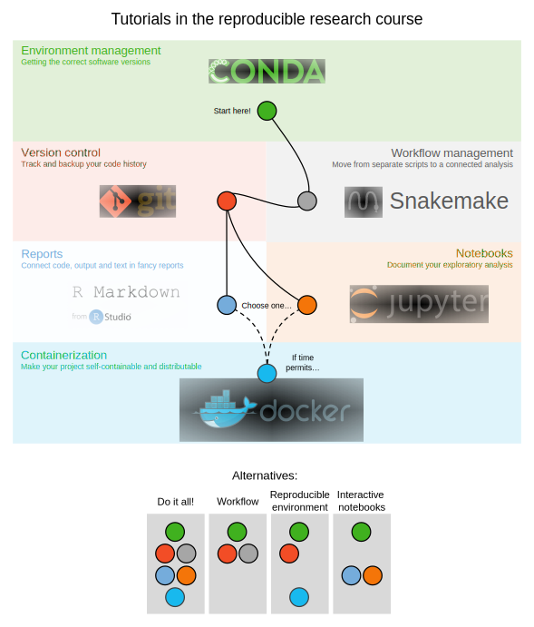

# Making bioinformatics research reproducible - from raw data to publication

Welcome to the tutorials! Here we will learn how to make a computational research project reproducible using the tools:

* Conda
* Snakemake
* Git
* R Markdown
* Jupyter
* Docker

The slides from the introductory lecture are available on Figshare as [pptx](https://doi.org/10.6084/m9.figshare.5674450) or [pdf](https://doi.org/10.6084/m9.figshare.5674453.v1).

## The case study
We will be running a small bioinformatics project as a case study, and use that to exemplify the different steps of setting up a reproducible research project. To give you some context, the study background and analysis steps are very briefly described below.

### Background

The data is taken from [Osmundson, Dewell, and Darst (2013)](http://journals.plos.org/plosone/article?id=10.1371/journal.pone.0076572), who have studied methicillin-resistant *Staphylococcus aureus* (MRSA).
MRSA is resistant to broad spectrum beta-lactam antibiotics and lead to difficult-to-treat infections in humans. Lytic bacteriophages have been suggested as potential therapeutic agents, or as the source of novel antibiotic proteins or peptides. One such protein, gp67, was identified as a transcription-inhibiting transcription factor with an antimicrobial effect. To identify *S. aureus* genes repressed by gp67, the authors expressed gp67 in *S. aureus* cells.
RNA-seq was then performed on three S. aureus strains:

* RN4220 with pRMC2 with gp67
* RN4220 with empty pRMC2
* NCTC8325-4

### Analysis

The graph below shows the different steps of the analysis that are included in this project.

* The input files are:
    * RNA-seq raw data (fastq files) for the three strains
    * *S. aureus* genome sequence (fasta file)
    * *S. aureus* genome annotation (gff file)


* `get_genome_fasta` - Downloads the genome file.
* `index_genome` - Indexes the genome, required for the alignment step, using the software Bowtie2.
* `get_SRA_by_accession` - Downloads the RNA-seq raw data for the three strains from the Sequence Read Archive (SRA).
* `fastqc` - Runs quality control on each of the RNA-seq fastq files, using the software FastQC.
* `multiqc` - Summarizes the QC.
* `align_to_genome` - Aligns the RNA-seq data from the three strains to the indexed genome, using the software Bowtie2.
* `sort_bam` - Sorts the alignment files by genome coordinate, using the software Samtools.
* `get_genome_gff3` - Downloads the genome annotation file.
* `generate_count_table` - Calculates gene expression by counting aligned reads per gene, using the software HTSeq-count.
* `generate_rulegraph` - Generates the workflow overview figure shown above.
* `make_supplementary` - Produces the Supplementary Materials section using data from the QC, gene counting and the graph figure.

# Setup
## For Mac / Linux users

Clone the git/bitbucket repository containing all files you will need for completing the tutorials. First, `cd` into a directory on your computer (or create one) where it makes sense to download the course directory.
```bash
cd /path/to/your/directory
git https://bitbucket.org/scilifelab-lts/reproducible_research_course.git
cd reproducible_research_course
```

## For Windows users
First, cd into a directory on your computer (or create one) where it makes sense to download the course directory. Install Docker by following the instructions in the [Docker tutorial](docker.md#windows). Then run:

```bash
cd c:/my_dir
docker run -it -p 8888:8888 -v /c/my_dir:/home/ scilifelablts/reproducible_research_course_slim
```

!!! attention
    Note that we use `/c/my_dir` and not `c:/my_dir` as we normally do on Windows. This is required for Docker to parse the command correctly.

This will start an isolated container running Linux, where the directory `c:/my_dir` is mounted (i.e. you can access the files in this Windows directory within the Linux container, and files edited or created within the Linux container will appear in this Windows directory).
Note that the idea is that you should edit files in the mounted `c:/my_dir` using an editor in your normal OS, say Notepad in Windows. The terminal in the container is for running stuff, not editing.

You should now be at a terminal in the Docker container. Now clone the git/bitbucket repository containing all the files you will need for the tutorials.

```bash
git clone https://bitbucket.org/scilifelab-lts/reproducible_research_course.git
cd reproducible_research_course
```

Don't worry if you feel that this Docker stuff is a little confusing, it will become clearer in the [Docker tutorial](docker.md). However, the priority right now is just to get it running so that you can start working.

# The tutorials

The figure below gives an overview of the six available tutorials, a very brief description of their main purpose, and the suggested order to do them. However, each tutorial is made so that it can be completed independently of the other tutorials. It is therefore perfectly possible to choose a different order, or a subset of tutorials that suits your interests. Under the main figure there is a list of a few suggested alternative tutorial orders. You find the tutorials in the menu to the left!



Note that running through the tutorials will involve installing several tools, which in turn will create quite a lot of files on your computer. In order to remove any traces of these, after completing the tutorials, please refer to the [Take down section](take_down.md).
